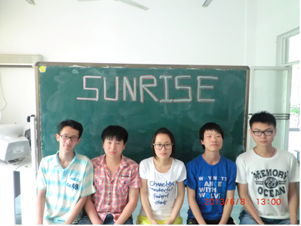

# Medium_05_RobotDigger
2013 年浙江省服务外包创新应用大赛二等奖作品

#关于
##Robot Digger:性能数据采集工具
宁波大红鹰学院       Sunrise软件开发团队

章灵晖、王庆、毛江雄、许伟沣、徐雅倩

指导教师：李晓蕾

随着科技的发展，智能手机在近年步入了高速发展的阶段。安卓平台以黑马的姿态，昂首挺进通讯市场，成为当今智能手机业的巨头。各式各样的安卓软件应运而生，因此提高手机软件性能变得十分重要。软件公司迫切需要一款测试软件高效性、准确性等性能的测试工具，以解决测试流程过于复杂和资金投入量大等问题。

**目标问题：**

1) 如何找出软件中存在的性能瓶颈，优化软件性能；

2) 如何进一步降低测试成本,提高软件开发公司的竞争力；

3) 如何提高软件测试的准确性和高效性，节省测试成本及时间；

4) 如何提高测试结果的清晰度、易理解性，直观表现测试结果，使之更加人性化；

5) 如何促进性能测试工具可持续发展。

**解决思路：**

1) 选择测试内容：借鉴软件性能指标，建立合理的测试数据方向，在进行测试之前，选择测试需检测的内容，如CPU、内存等,使测试结果更具针对性；

2) 自动采集数据：通过自动收集数据，按照设置的采集频率自动采集数据，为测试人员提供自动测试服务，输出并保存测试结果，从而降低测试成本；

3) 真机测试平台：直接在真机上测试软件，不需要上传软件，提高测试效率和准确性；

4) 图形化显示：采用图表方式分析数据，图形化显示测试结果，直观形象的表达测试结果，更易发现和理解软件的性质、特征及其变化规律；

5) 借鉴国际先进测试功能，规范工作流程，完善测试工具，促进性能测试工具可持续发展。如增加文件分类、显示浮窗、找回密码等功能完善测试工具。

**实现过程：**

* 关于团队

Sunrise团队有学院及老师的安排，根据市场需求，历时三个月，开发出了一款能够对软件实时测试。团队成员如下图所示。

* 管理制度

针对成员自身性格、技术实力和兴趣点安排职位，成员间能力具有互补性。

1) 项目经理：章灵晖。制定项目总体计划，安排每个项目成员工作，明确项目目标，对项目实行质量，安全，进度，成本管理的责任。

2) 技术总监：许伟沣。制定技术标准和相关流程，实现技术管理和支撑目标，组织技术，定期进行技术分析和质量分析工作，制定防御和纠正措施。

3) 客户经理：毛江雄。全面了解客户需求，确立目标市场和潜在客户，建立客户档案，保持与客户的联系和调动客户资源。

4) 创意总监：王庆。组织实施项目品牌设计策划中的创意工作和理念传达，深刻理解品牌构建需求中的商业创意和设计，组织并监督创意作品的完成

5) 艺术总监：徐雅倩。负责多媒体项目整体视觉设计，准确把握设计风格和理念，为团队成员提供艺术、技术上的指导。

* 团队文化

学习交流：

有良好的学习气氛，在交流中成长。在团队开发中，努力学习新知识新概念。
问题解决：

由于研发时间较为紧张，采用分工合作同步进行的方式来解决问题。当遇到需求定义歧义时，开展研讨会的形式解决将不同意见汇集成为综合意见。如下图所示。

* 技术支持

Java语言是目前使用最广泛的网络编程语言，简单易学，面向对象，稳定，与平台无关。MYSQL是开源软件，使用免费，日后的升级维护也都是免费的，数据访问速度快，简单易于上手，常用功能都有，和开源软件配合很好；

技术总监、项目经理等大部分项目成员熟练掌握Java，J2EE语言，能熟练使用Android系统的系统库，对Android的熟悉度高。

**主要特色：**

1) 文件分类:根据被测软件对测试结果进行分类，方便测试人员查找测试结果；效果图如下图所示。

2) 显示浮窗:悬浮测试结果,实时观察测试过程；效果图如下图所示。

3) 图形化显示:图形化显示测试结果，直观显示程序性能,点击测试点,可查看详细信息；效果图如下图所示。

4) 测试备份：提供测试结果备份，保障测试安全性；效果图如下图所示。

5) Web数据端：提供分享测试文件的下载,根据提取码下载测试文件。效果图如下图所示。

